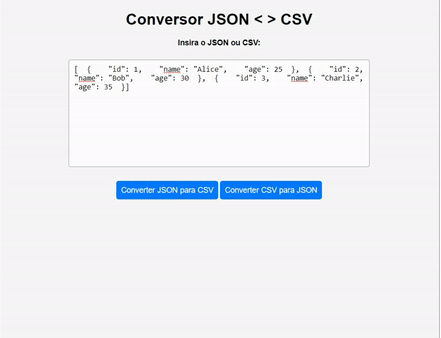

# Conversor JSON <> CSV

Projeto desenvolvido em HTML,CSS e Java Script. O site desenvolvido é um conversor de JSON para CSV e CSV para JSON online.

É possível fazer o download do arquivo CSV e copiar o arquivo JSON.

## Teste de funcionalidade
A pasta exemplos contém os exemplos de CSV e JSON para testar a funcionalidade do projeto.

🔗 [Click here to access](https://n4ju15.github.io/conversor_json_csv/)

## Tecnologias

- HTML
- CSS
- JavaScript
- Git and Github
